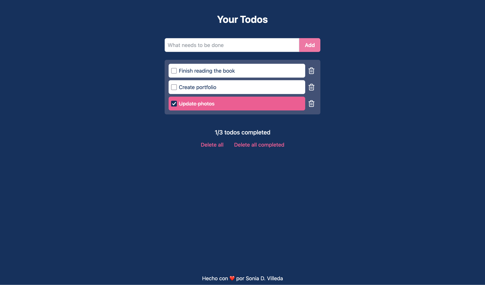

# Modern Todo App

A sleek, functional task management application built with **React**, **TypeScript**, and **Tailwind CSS**. This project focuses on clean UI/UX, custom state management through hooks, and data persistence.



## Features

- **Task Management**: Add, toggle completion, and delete tasks.
- **Bulk Actions**: Dedicated functions to "Delete All" or "Delete All Completed" tasks.
- **Data Persistence**: Integrated with `localStorage` so your tasks remain even after refreshing the page.
- **Dynamic Styling**: Conditional CSS classes for completed states and hover effects.
- **Responsive Design**: Built with a mobile-first approach using Tailwind CSS.
- **Custom Hook Logic**: Clean separation of concerns using a custom `useTodos` hook.

## Tech Stack

- **Framework**: [React](https://reactjs.org/)
- **Language**: [TypeScript](https://www.typescriptlang.org/)
- **Styling**: [Tailwind CSS](https://tailwindcss.com/)
- **State Management**: React Hooks (useState, useEffect)
- **Icons**: Lucide-React

## Installation

1. **Clone the repository**

   ```bash
   git clone [https://github.com/sovilleda07/todo-list-react](https://github.com/sovilleda07/todo-list-react)
   cd todo-list-react

   ```

2. **Install dependencies**

   ```bash
   npm install

   ```

3. **Run the development server**

   ```bash
   npm run dev

   ```

4. **Build for production**

   ```bash
   npm run build

   ```

5. **Open in browser**
   ```bash
    http://localhost:5173
   ```
